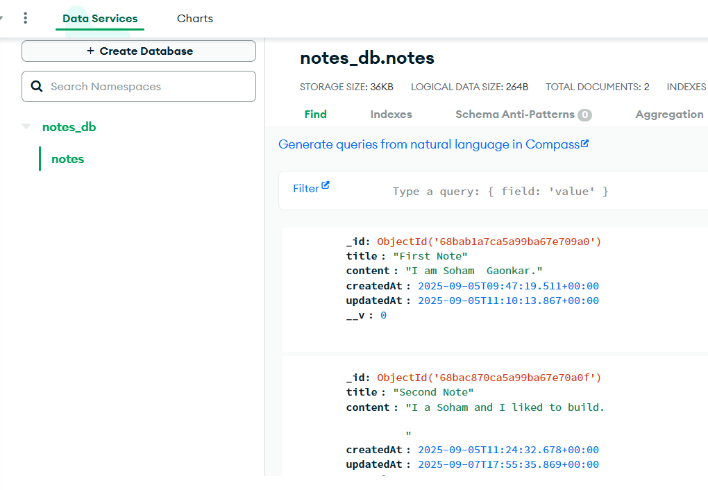
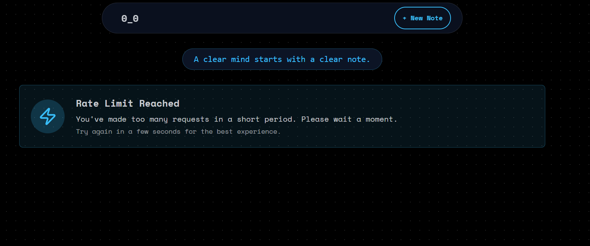
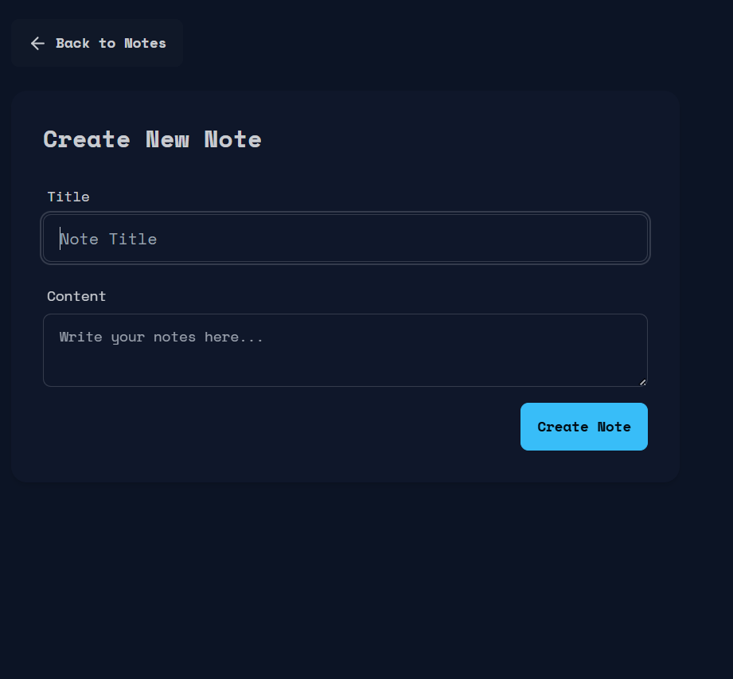
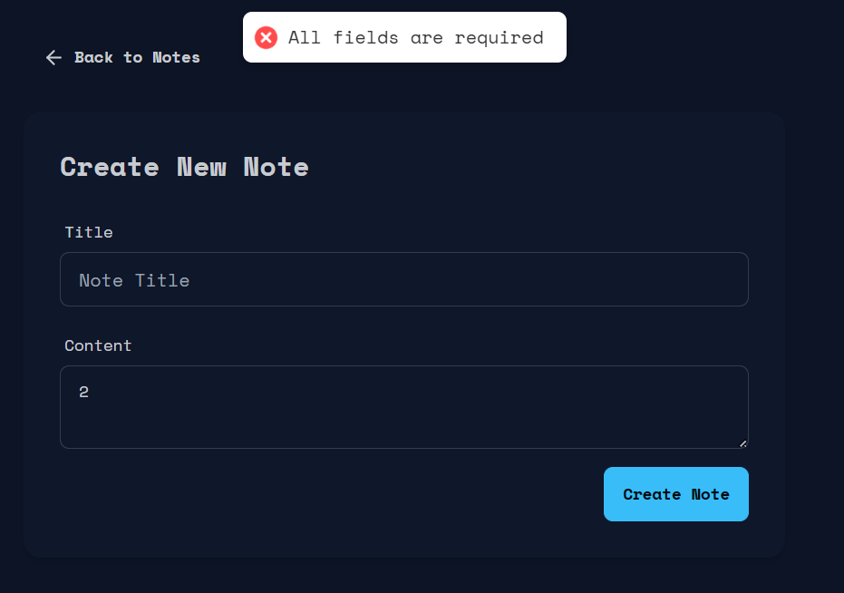
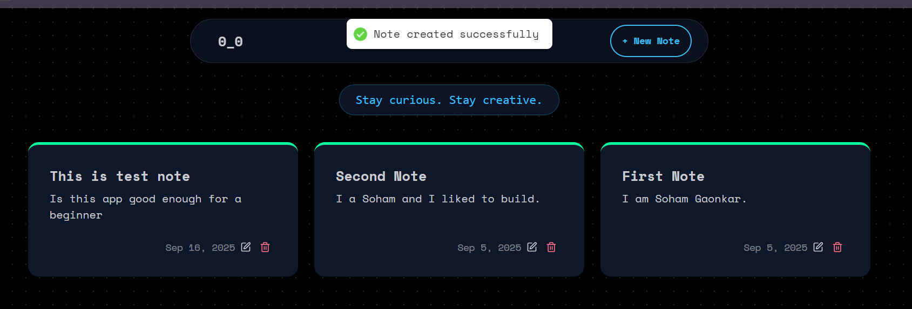
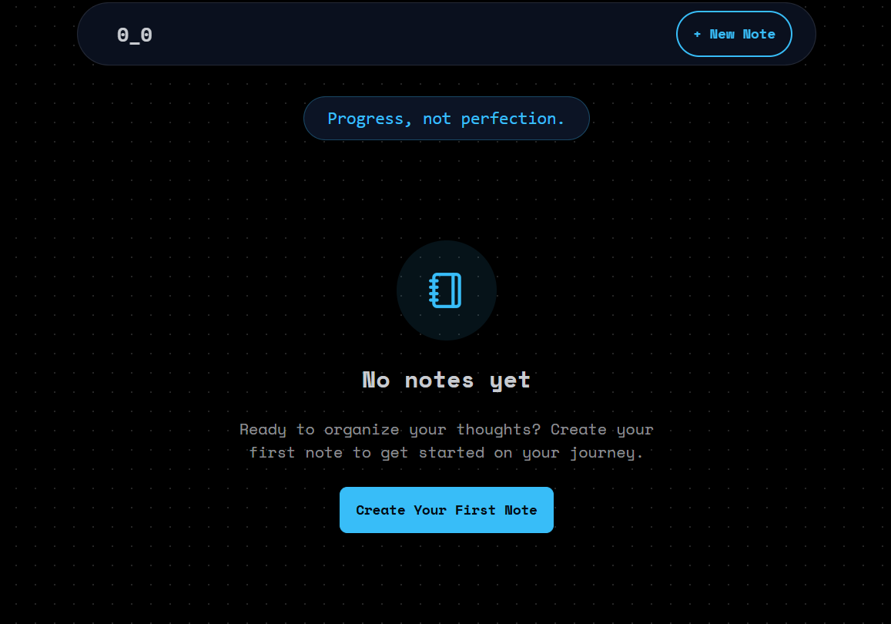
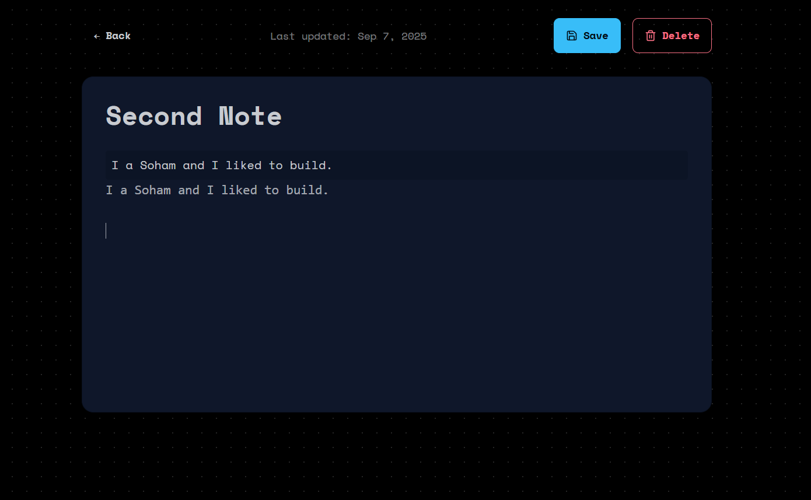
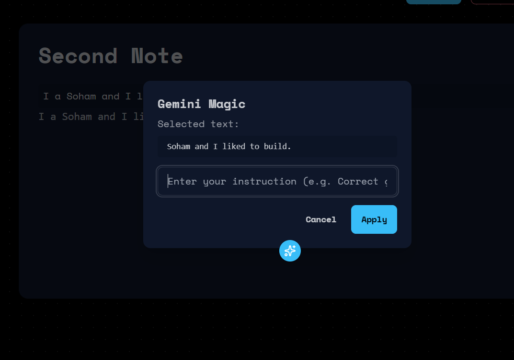
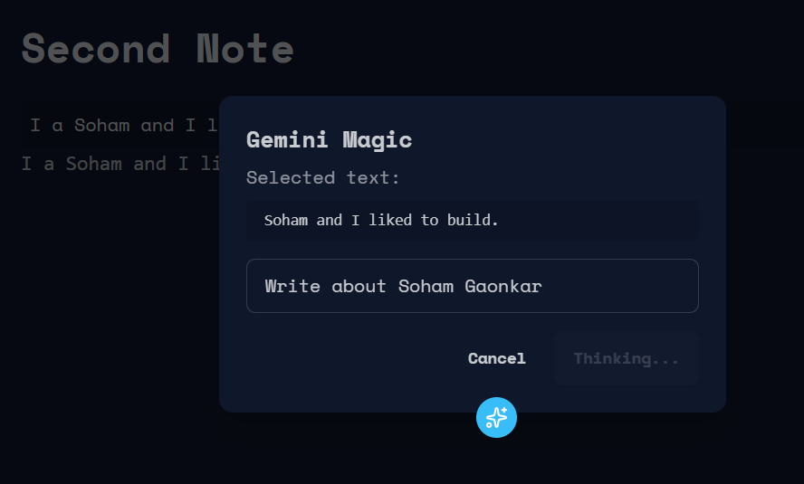
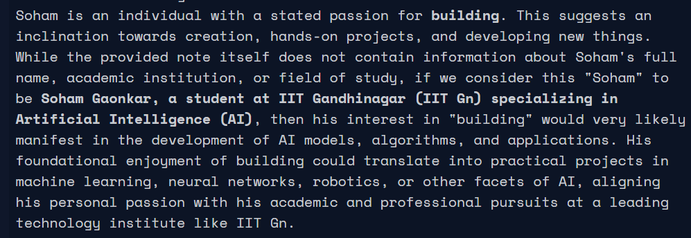

# Notes App  

A simple and efficient note-taking web app built with **Vite**, **React**, **Express**, and **MongoDB**.  
Includes AI-powered note editing with **Gemini**, rate limiting with **Upstash**, and a clean UI for creating, editing, and managing notes.  

👉 Check out the codebase here: [Notes Repository](https://github.com/Soham-Gaonkar/Notes)  

---

## 🚀 Tech Stack
- **Frontend:** Vite + React  
- **Backend:** Express.js  
- **Database:** MongoDB  
- **Other Integrations:**  
  - **Upstash** (Rate Limiting)  
  - **Gemini** (AI-powered note editing)  

---

## 🔎 Why these choices

**Vite** — extremely fast dev server ; faster builds so dev iteration is quick.  
**React** — component-driven UI makes editor, lists and forms reusable and easy to maintain.  
**Express** — minimal, reliable REST API for handling note CRUD and middleware.  
**MongoDB** — document storage maps naturally to notes and lets you iterate without schema migrations.  
**Upstash** — managed Redis for simple, low-ops rate-limiting and short-term caching.  
**Toast notifications** — used for instant user feedback (success / error / info) to improve UX

---

## ✨ Features
- 📝 Create, edit, and delete notes  
- 🗂️ Organized note management with a **New Note** option in the navbar  
- ⚡ Fast and lightweight frontend with **Vite**  
- 📦 Persistent storage with **MongoDB**  
- ⏳ Rate limiting powered by **Upstash**  
- 🤖 AI-assisted editing using **Gemini**  

---

## 📸 Screenshots  

**Navbar with New Note Option**  


**MongoDB Database**  


**Upstash / Rate Limiting**  


**Create Note Page**  
  
  


**New Notes**  


**Edit Note Page**  


**Edit Note with Gemini**  
  
  


---

## 🛠️ Setup & Installation  

1. Clone the repo:  
   ```bash
   git clone https://github.com/Soham-Gaonkar/Notes.git
   cd Notes
   ```

2. Install dependencies

```bash
   npm install
```


3. Setup environment variables
Create a .env file in the root directory with the following:

```bash
   MONGO_URI=your_mongodb_connection_string
   UPSTASH_REDIS_URL=your_upstash_url
   UPSTASH_REDIS_TOKEN=your_upstash_token
   GEMINI_API_KEY=your_gemini_api_key
   PORT=5000
```
Create a `.env` file in the root directory with the following:
``` bash
MONGO_URI=your_mongodb_connection_string
UPSTASH_REDIS_URL=your_upstash_url
UPSTASH_REDIS_TOKEN=your_upstash_token
GEMINI_API_KEY=your_gemini_api_key
PORT=5000
 ```

4. Start development server (backend and frontend)

```bash
   npm run dev
```

5. Build for production

```bash
   npm run build
   npm start
```